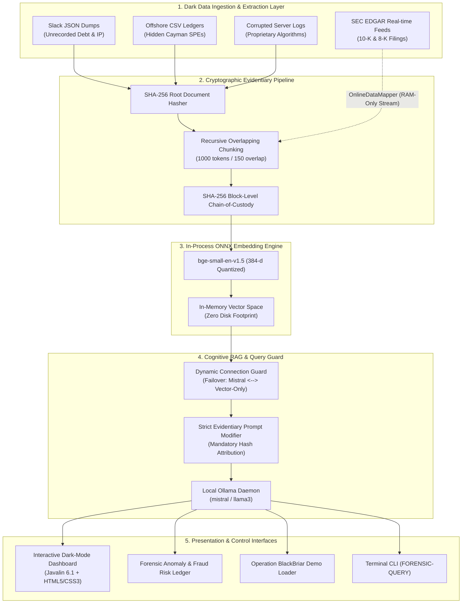

# 🛡️ Dark Data Forensics Vault

<p align="center">
  <a href="https://github.com/arjulatejdeep-dotcom/dark-data-forensics-vault/actions/workflows/ci.yml">
    
  </a>
  <a href="https://codespaces.new/arjulatejdeep-dotcom/dark-data-forensics-vault">
    
  </a>
  
  
  
  
  
  
</p>

> **Enterprise-Grade, Zero-Budget, 100% Air-Gapped Multi-AI Java Platform for Forensic Dark Data Discovery, M&A Due Diligence, and Corporate Fraud Audit Intelligence.**

---

## 📑 Executive Summary

During major corporate mergers, acquisitions, bankruptcies, and regulatory audits, over **80% of an enterprise's critical liabilities exist as dark data**—unstructured Slack message dumps, unindexed financial CSVs, corrupted server logs, and dense regulatory filings.

Due to strict data residency laws (GDPR, HIPAA, SEC, CCPA), **enterprises cannot upload unvetted corporate dark data to public cloud AI APIs**.

**Dark Data Forensics Vault** solves this enterprise crisis:
- **$0 Cloud Budget**: Zero external API dependencies (no OpenAI, Pinecone, or AWS tokens).
- **100% Air-Gapped Sovereignty**: In-process ONNX vectorization and local Ollama inference ensure zero network telemetry.
- **Cryptographic Chain of Custody**: Computes and indexes SHA-256 block hashes with parent-child audit lineage admissible in legal proceedings.
- **In-Memory Streaming**: Reads SEC EDGAR 10-K & 8-K filings directly into volatile RAM without leaving forensic traces on disk.

👉 **Looking for the executive presentation?** Read the full [Enterprise Showcase & C-Level Pitch Deck](enterprise_showcase.md).

---

## 🏛 Multi-Agent System Architecture



---

## 🖥️ Interactive Web Dashboard & Control Center

The vault features a zero-dependency, dark-themed responsive web dashboard hosted locally via **Javalin 6.1**:

| Feature Component | Description |
| :--- | :--- |
| **Operation BlackBriar Demo** | Interactive 4-step guided case study uncovering **$18.5M in unrecorded offshore debt**, secret side letters, and executive concealment in Slack logs. |
| **Cognitive Semantic Search** | Natural language RAG interface citing exact cryptographic SHA-256 source coordinates for every finding. |
| **Forensic Risk Ledger** | Categorizes and color-codes critical, high, and medium anomalies (Executive Concealment, Unhedged Derivatives, Purchase Obligations). |
| **In-Memory SEC EDGAR Mapper** | 1-click RAM streaming for Apple, Tesla, and Microsoft regulatory reports with `diskBypassed: true`. |
| **Dynamic Connection Guard** | Auto-probes local Ollama health; dynamically switches between `LOCAL_OLLAMA_RAG` and `SOVEREIGN_AIR_GAPPED_VECTOR`. |

---

## 🛠️ Technology Stack

- **Runtime**: Java 21 LTS (Eclipse Temurin)
- **AI Orchestration**: LangChain4j (`1.0.0-beta1`)
- **Embedding Engine**: ONNX Runtime (`bge-small-en-v1.5`, 384 dimensions)
- **Local LLM**: Ollama (`mistral`, `llama3`) running at `localhost:11434`
- **Web Layer**: Javalin 6.1.3 (Embedded Jetty micro-server)
- **Data Scrubber**: Apache Tika & Jackson Core JSON
- **CI/CD**: GitHub Actions (Ubuntu, JDK 21, automated verification)
- **Cloud Execution**: GitHub Codespaces DevContainer

---

## 🚀 Quickstart Guide

### Option 1: Run Live in GitHub Codespaces (1-Click Cloud Execution)

No local setup or installation required! Click below to spin up a pre-configured cloud workspace:

[](https://codespaces.new/arjulatejdeep-dotcom/dark-data-forensics-vault)

Inside the Codespaces terminal:
```bash
mvn compile exec:java
```
Codespaces will detect port `8085` and prompt you to **Open in Browser**.

---

### Option 2: Run Locally (Windows, macOS, Linux)

#### Prerequisites
- **Java 21+** (`java -version`)
- **Maven 3.9+** (`mvn -version`)
- *(Optional for full generative RAG)*: [Ollama](https://ollama.com) (`ollama run mistral`)

#### 1. Clone the Repository
```bash
git clone https://github.com/arjulatejdeep-dotcom/dark-data-forensics-vault.git
cd dark-data-forensics-vault
```

#### 2. Run Automated Verification Tests
Executes the offline test suite verifying ONNX embedding loading, SHA-256 chain of custody, and REST endpoints:
```bash
mvn test
```

#### 3. Launch the Server & Interactive Dashboard
```bash
mvn compile exec:java
```
- Open **`http://localhost:8085`** in your browser.
- Terminal CLI prompt `FORENSIC-QUERY >` is active simultaneously.

---

## 📡 REST API Reference

| Endpoint | Method | Payload / Params | Description |
| :--- | :--- | :--- | :--- |
| `/api/stats` | `GET` | None | Returns active block count, embedding dimensions, and execution mode. |
| `/api/query` | `POST` | `{"question": "string"}` | Executes cognitive RAG query with cryptographic source citations. |
| `/api/risk-ledger` | `GET` | None | Retrieves all flagged forensic anomalies and unrecorded liabilities. |
| `/api/audit` | `GET` | None | Dumps the complete SHA-256 chain of custody and block ledger. |
| `/api/map-online` | `POST` | `{"cik": "...", "accession": "...", "doc": "..."}` | Streams SEC EDGAR filing directly into RAM with zero disk write. |
| `/api/ollama/refresh` | `POST` | None | Triggers dynamic pre-flight probe to hot-reconnect local Ollama daemon. |
| `/api/demo/fraud` | `POST` | `{"step": 1-4}` | Executes Operation BlackBriar forensic demonstration stages. |

---

## 💼 Enterprise Case Study: Operation BlackBriar

The vault includes a simulated forensic investigation into **Project Chimera / QuantumTech Ltd**:

```
[AUDIT TIMELINE]
├── STEP 1: Ingests 558 vector blocks across unindexed files
├── STEP 2: Surfaces $18,500,000 unrecorded debt facility in Cayman SPE ledger
├── STEP 3: Pinpoints CFO directive in Slack logs instructing omission of $450K liability
└── STEP 4: Synthesizes executive forensic brief with SHA-256 evidence block coordinates
```

---

## 📜 License

This project is licensed under the [MIT License](LICENSE). Built for enterprise due diligence, forensic audits, and sovereign air-gapped security research.
